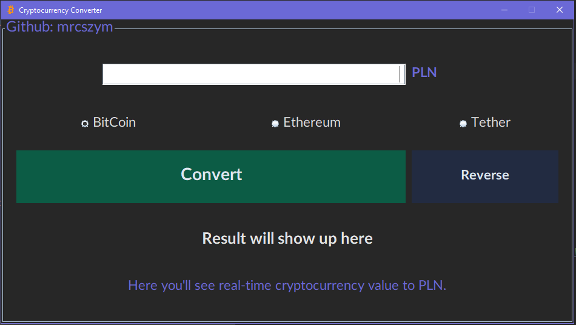
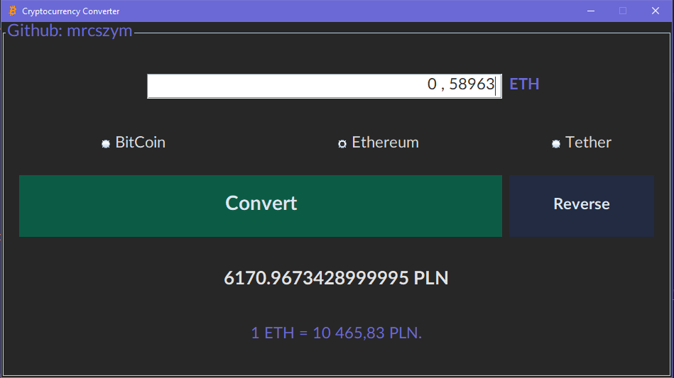
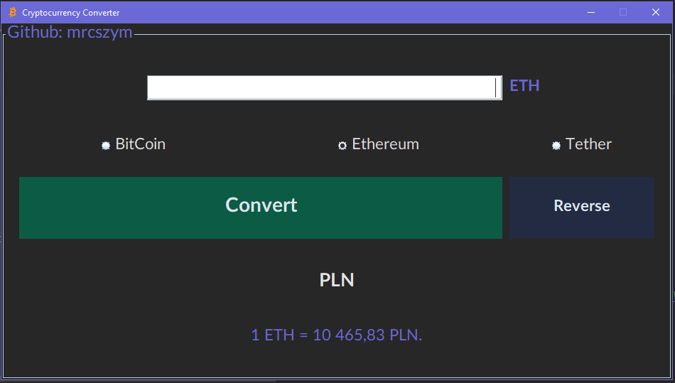

# CryptoConverter

Polish currency to cryptocurrency (BitCoin, Ethereum or Tether) and in reverse converter. 
I used Maven Jsoup Java HTML Parser (https://mvnrepository.com/artifact/org.jsoup/jsoup) to fetch actual crypto values from web.
App has been written all in Intellij IDEA GUI.

Screenshots of app:

