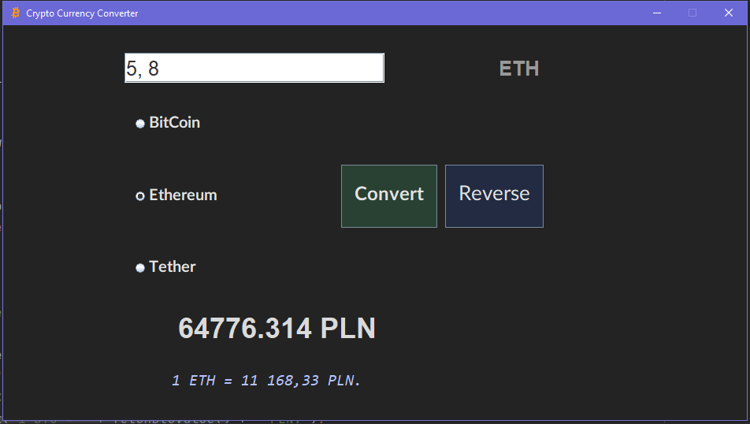

# CryptoConverter

Real-time cryptocurrency (BitCoin, Ethereum or Tether) to PLN converter. 
I used Maven Jsoup Java HTML Parser (https://mvnrepository.com/artifact/org.jsoup/jsoup) to fetch actual crypto values from web.
App has been written all in Intellij IDEA GUI.

